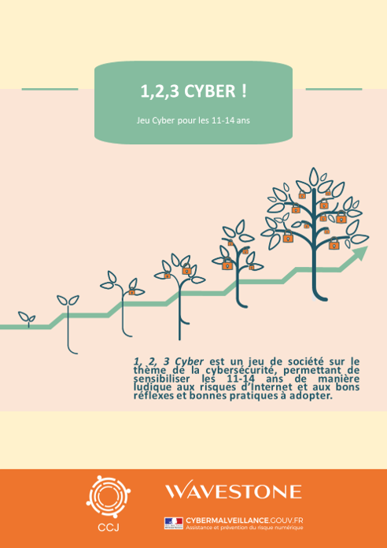

# 1,2,3 Cyber

1,2,3 Cyber est un __jeu de société sur le thème de la cybersécurité__, permettant de sensibiliser les 11-14 ans de manière ludique aux risques d’Internet et aux bons réflexes et bonnes pratiques à adopter.

Ce jeu est le __fruit d’une collaboration entre l’association CCJ et le cabinet de conseil Wavestone__, avec la __participation du dispositif Cybermalveillance__.

# Pour jouer

Simple à imprimer et à transporter pour une utilisation la plus massive possible, le kit de jeu est constitué :

  
   
  <a href="1%2C2%2C3%20Cyber%20-%20Jeu%20de%20cartes.pdf">D'un jeu de 35 cartes (PDF)</a>

  
   
  <a href="https://github.com/wavestone-cdt/1-2-3-Cyber/raw/master/1%2C2%2C3%20Cyber%20-%20Livret%20animateur.pdf">D'un livret animateur (PDF)</a>

# Pour contribuer

Ce jeu est diffusé en licence libre : vous pouvez le modifier à votre guise tant que les conditions de la [licence](LICENSE) sont respectées.

Les fichiers modifiables sont au format PPTX et sont en téléchargement libre :
- [Jeu de cartes (PPTX)](sources/1%2C2%2C3%20Cyber%20-%20Jeu%20de%20cartes.pptx)
- [Livret (PPTX)](sources/1%2C2%2C3%20Cyber%20-%20Livret%20animateur.pptx)

Pour toute proposition de modification :
- Vous pouvez contacter 123cyber@wavestone.com et contact@cyberccj.com
- Les versions textes des cartes et du livret seront bientôt déposées afin de faciliter l'injection et le suivi de vos propositions

# A propos des initiateurs du projet

## Le CCJ : Centre de la Cybersécurité pour les Jeunes
L’association « Centre de la Cybersécurité pour les Jeunes » (CCJ) a pour objectif de sensibiliser les jeunes aux enjeux de la cybersécurité, à la dynamique du cyberharcèlement ainsi qu’à l’importance de l’e-réputation. Ses objectifs sont les suivants : organiser, animer et participer à des programmes d’éducation, de sensibilisation et de formation ainsi qu’à des conférences traitant des sujets de la cybersécurité, du cyberharcèlement et de l’e-réputation :
- Sensibiliser les jeunes, le corps enseignant ainsi que les médias des jeunes aux sujets de la cybersécurité, du cyberharcèlement et de l’e-réputation 
- Sensibiliser les conseillers d’orientation aux métiers de la cybersécurité 
- Proposer un programme de mentorat des jeunes par des professionnels en cybersécurité 
- Nouer des partenariats avec des organismes qui permettront au CCJ de sensibiliser les jeunes aux enjeux de la cybersécurité, à la dynamique du cyberharcèlement ainsi qu’à l’importance de l’e-réputation 
- Publier des articles et des vidéos de sensibilisation

Pour en savoir plus : https://www.cyberccj.com/

## Wavestone
Au croisement du conseil en management et du conseil en digital, Wavestone accompagne les grandes entreprises et organisations dans leurs transformations les plus critiques avec la conviction qu’il ne peut y avoir de transformation réussie sans une culture partagée de l’enthousiasme.
Wavestone constitue le 1er cabinet de conseil indépendant en France. Il rassemble plus de 3100 collaborateurs à travers le monde, dont 500 spécialisés sur les sujets de cybersécurité et confiance numérique.

Au-delà de ses opérations dans ce domaine, Wavestone s'implique dans la sensibilisation du grand public aux risques liés au numérique et s’engage pour le développement d’une meilleure hygiène numérique globale. Cet engagement se matérialise par exemple par l’implication dans l’élaboration d’un cahier de vacances de sensibilisation des 7-11 ans porté par l’association ISSA France (« les As du Web »), la publication régulière de vidéos de sensibilisation tournées par et avec des collaborateurs de Wavestone, etc.
Ce jeu de société constitue un autre exemple de l’engagement de Wavestone auprès du grand public.

Pour en savoir plus : https://www.wavestone.com

# A propos des contributeurs

## Cybermalveillance
Cybermalveillance.gouv.fr et le dispositif national français d'assistance aux victimes de cybermalveillance et de sensibilisation aux risques numériques des publics, quels que soient leur âge et leur niveau de connaissance en matière de sécurité du numérique.

La plateforme en ligne Cybermalveillance.gouv.fr assure un accompagnement à deux niveaux :
- Vous êtes victimes d'actes de cybermalveillance (escroqueries, piratage de comptes...) ? Cybermalveillance.gouv.fr fait un diagnostic précis de votre situation et vous met en relation, le cas échéant, avec les spécialistes et organismes compétents proches de chez vous 
- Vous souhaitez comprendre les risques numériques et savoir comment réagir ou adopter les bonnes pratiques ? Cybermalveillance.gouv.fr met à disposition des outils de sensibilisation et de nombreux conseils sur des thématiques du quotidien, et sous différents formats (vidéos, fiches réflexes, mémos, bandes-dessinées...).

Pour en savoir plus : www.cybermalveillance.gouv.fr.
